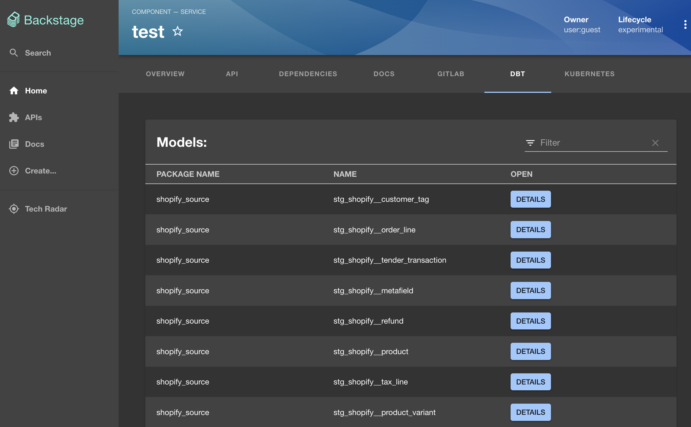
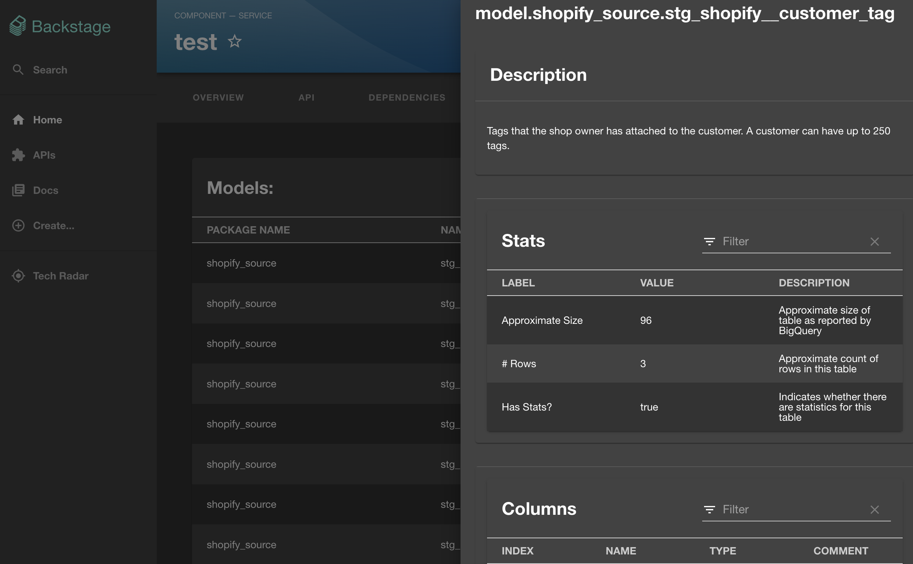
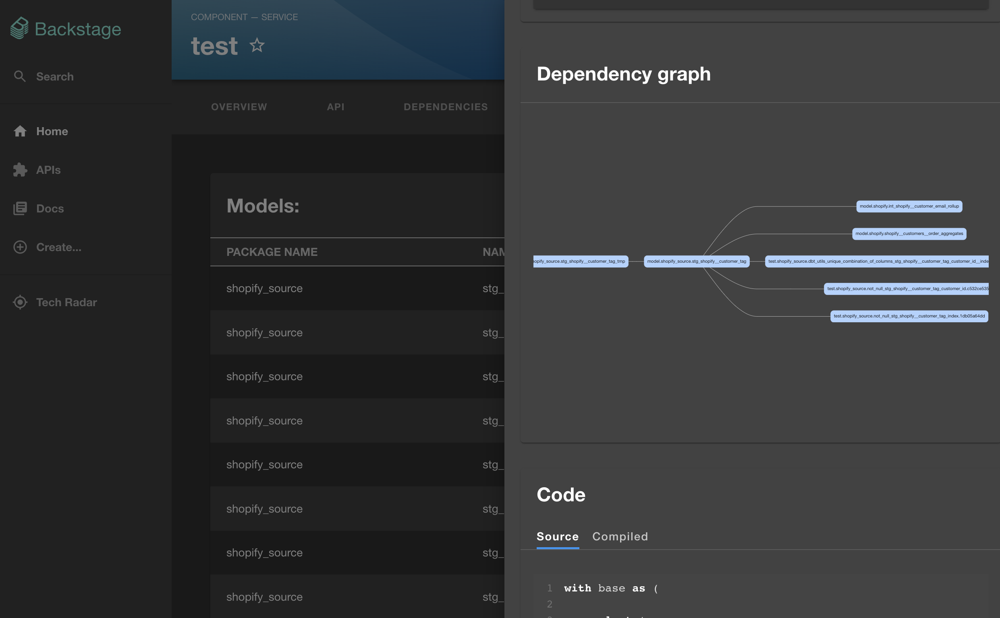
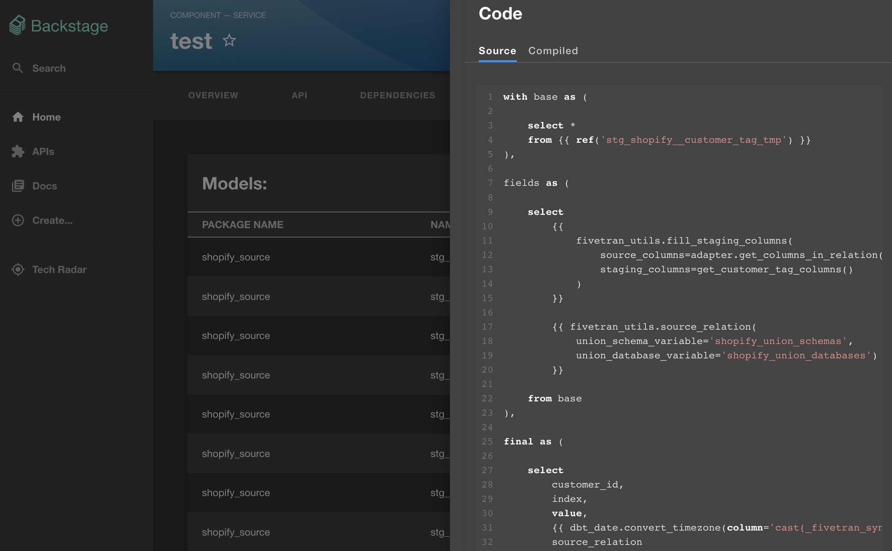
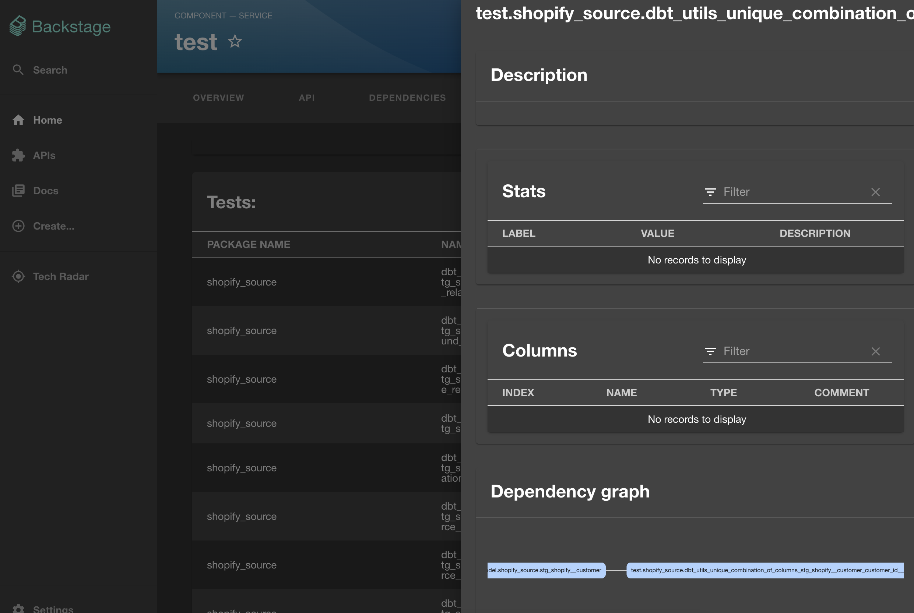

<h1 align="center">Backstage Plugin dbt</h1>

> [Backstage](https://backstage.io/) plugins to view [dbt doc](https://www.getdbt.com/product/data-documentation/).

## Table of contents

<!-- toc -->

-   [Features](#features)
-   [Limitations](#limitations)
-   [Screenshots](#screenshots)
-   [Setup](#setup)
-   [Usage](#usage)

## Features

- List all dbt models and tests
- Get details on dbt models and tests like:
   - Documentations
   - Stats
   - Columns
   - Dependency graph
   - Code source (raw and compiled) 

## Limitations

**This version only support Google Cloud Storage as backend to store `manifest.json`
and `catalog.json` files.**

## Screenshots

Landing page:


Model details:




Test details:


Note: catalog and manifest come from [https://github.com/fivetran/dbt_shopify/tree/main](https://github.com/fivetran/dbt_shopify/tree/main)

## Setup

1. Install packages:

```bash
# From your Backstage root directory
yarn --cwd packages/app add @iiben_orgii/backstage-plugin-dbt
yarn --cwd packages/backend add @iiben_orgii/backstage-plugin-dbt-backend
```

2. Add a new dbt tab to the entity page.

`packages/app/src/components/catalog/EntityPage.tsx`

```tsx
// packages/app/src/components/catalog/EntityPage.tsx

import { DbtPage, isDBTAvailable } from "@iiben_orgii/backstage-plugin-dbt"

// Farther down at the serviceEntityPage declaration
const serviceEntityPage = (
    <EntityLayout>
        {/* Place the following section where you want the tab to appear */}
        <EntityLayout.Route if={isDBTAvailable} path="/dbt" title="dbt">
            <DbtPage />
        </EntityLayout.Route>
    </EntityLayout>
);
```

6. Add the `dbt` route by creating the file `packages/backend/src/plugins/dbt.ts`:

`packages/backend/src/plugins/dbt.ts`

```ts
// packages/backend/src/plugins/dbt.ts
import { createRouter } from '@iiben_orgii/backstage-plugin-dbt-backend';
import { Router } from 'express';
import { PluginEnvironment } from '../types';

export default async function createPlugin(
  env: PluginEnvironment,
): Promise<Router> {
  return await createRouter({
    logger: env.logger,
  });
}
```

then you have to add the route as follows:

`packages/backend/src/index.ts`

```ts
// packages/backend/src/index.ts
import dbt from './plugins/dbt';

async function main() {
    //...
    const dbtEnv = useHotMemoize(module, () => createEnv('dbt'));
    //...
    apiRouter.use('/dbt', await dbt(dbtEnv));
    //...
}
```

## Usage

Add `dbtdoc-bucket` as annotation in `catalog-info.yaml`:

```yaml
apiVersion: backstage.io/v1alpha1
kind: Component
spec:
  type: service
  owner: user:guest
  lifecycle: experimental
metadata:
  name: "test"
  annotations:
    dbtdoc-bucket: "my-bucket"
```

You can upload your `manifest.json` and `catalog.json` to a GCS Bucket as follow:
- `{dbtdoc-bucket}/{kind}/{name}/manifest.json`
- `{dbtdoc-bucket}/{kind}/{name}/catalog.json`

For authentification to GCS Bucket, the plugin use ADC credentials [https://cloud.google.com/docs/authentication/provide-credentials-adc](https://cloud.google.com/docs/authentication/provide-credentials-adc).